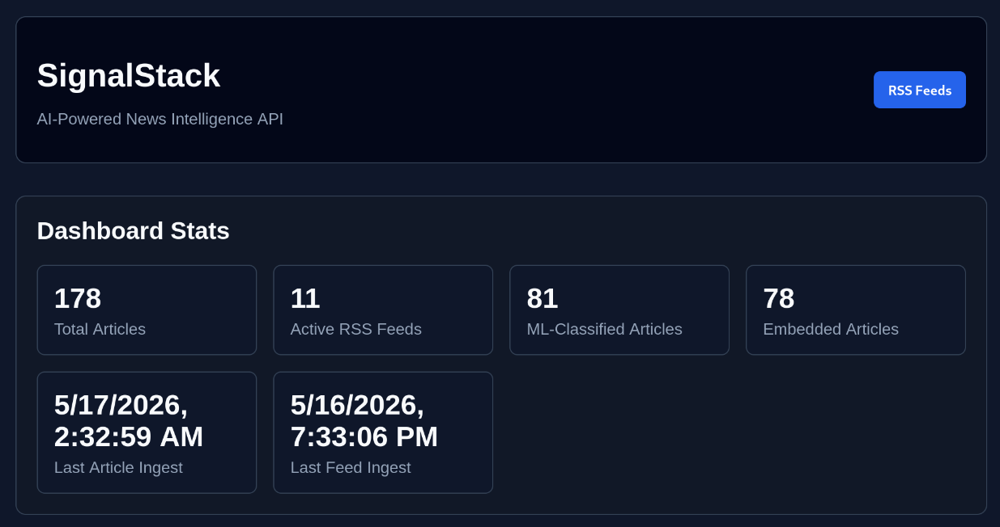
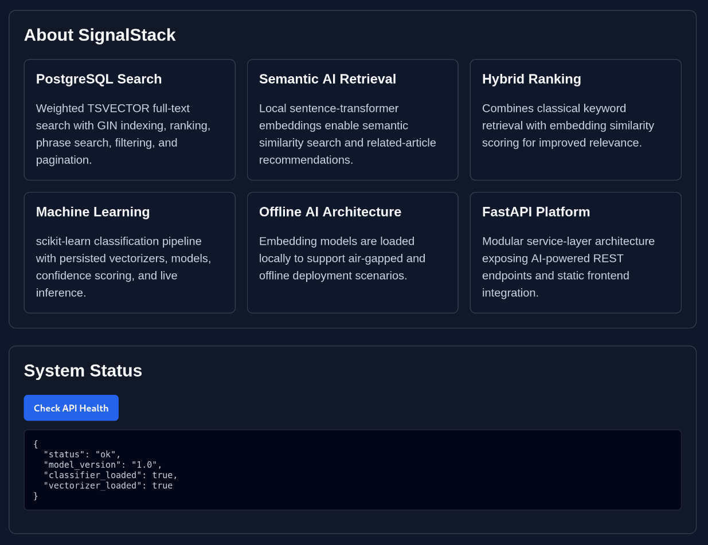
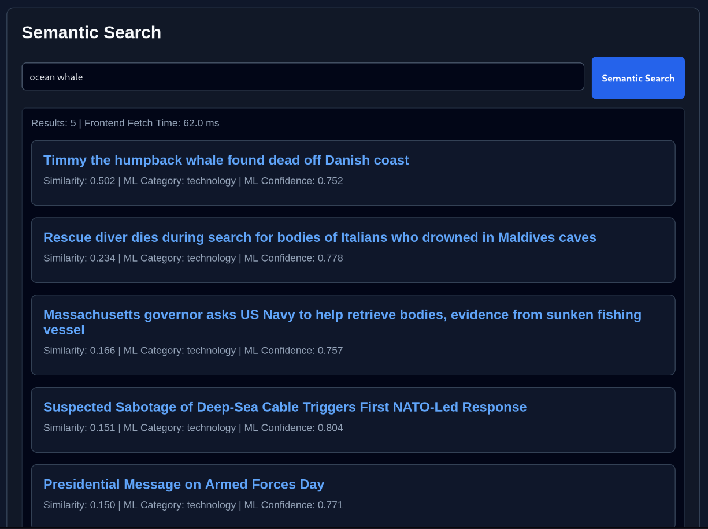
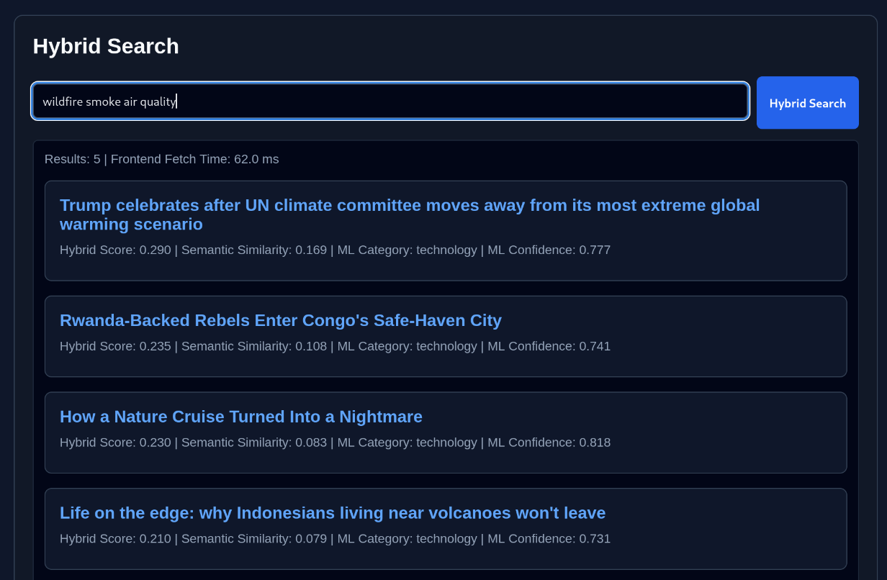

# SignalStack

AI-powered news intelligence platform built with FastAPI, PostgreSQL, machine learning, semantic embeddings, and hybrid retrieval.

SignalStack ingests RSS news feeds, enriches articles using AI/ML pipelines, stores semantic embeddings locally, and exposes operational APIs and a lightweight frontend dashboard for search, ingestion, and analytics workflows.

---

# Features

## News Ingestion

- RSS feed ingestion pipeline
- Configurable feed source management
- Duplicate detection
- Operational ingestion dashboard
- Feed synchronization between config and database
- Feed health/error visibility
- Live ingestion triggering from frontend

## Search & Retrieval

- PostgreSQL TSVECTOR full-text search
- Weighted ranking with `ts_rank_cd`
- Phrase search
- Keyword filtering
- Semantic embedding search
- Related article retrieval
- Hybrid keyword + semantic ranking
- Pagination and sorting

## AI & Machine Learning

- Local/offline sentence-transformer embeddings
- scikit-learn article classification
- ML confidence scoring
- Persisted vectorizers and model artifacts
- Live inference API
- Article similarity retrieval
- Unsupervised clustering demo
- Embedding persistence in PostgreSQL

## Frontend Dashboard

- Static frontend served by FastAPI
- Dashboard statistics cards
- Sticky operational navigation
- RSS feed operational modal
- Live ingestion controls
- Semantic search interface
- Hybrid search interface
- ML prediction testing
- Related article lookup
- Live dashboard refresh after ingestion

## Operational Features

- RSS feed source synchronization
- Ingestion metrics and visibility
- Feed activation/deactivation
- Last ingest timestamps
- Error propagation to frontend
- Offline-capable AI architecture
- Service-layer organization
- Dockerized PostgreSQL deployment

---

# Technology Stack

## Backend

- Python 3.13
- FastAPI
- SQLAlchemy ORM
- Alembic
- PostgreSQL 16
- Docker

## Machine Learning & AI

- scikit-learn
- sentence-transformers
- semantic embeddings
- cosine similarity retrieval
- TF-IDF vectorization
- Naive Bayes classification

## Frontend

- HTML
- CSS
- JavaScript

---

# Architecture Overview

SignalStack follows a modular service-layer architecture:

RSS Feeds  
→ Ingestion Pipeline  
→ Article Cleaning & Enrichment  
→ ML Classification  
→ Semantic Embedding Generation  
→ PostgreSQL Storage  
→ Search / Retrieval APIs  
→ Frontend Dashboard

Core architectural goals:

- offline-capable AI workflows
- reusable service-layer logic
- modular API endpoints
- explainable retrieval systems
- incremental platform evolution
- lightweight deployment footprint

---

# Frontend Demo Dashboard

SignalStack includes a lightweight frontend dashboard served directly by FastAPI.

Frontend URL:

`http://127.0.0.1:8000/demo`

The dashboard supports:

- viewing live platform statistics
- triggering RSS ingestion
- keyword article search
- semantic embedding search
- hybrid retrieval search
- ML prediction testing
- RSS feed operational visibility
- related article lookup

The frontend intentionally uses plain HTML, CSS, and JavaScript to keep the project lightweight and focused on backend engineering, AI retrieval systems, and operational workflows.

## Dashboard Overview



## Platform Architecture & Status



## Semantic Search



## Hybrid Retrieval



---

# API Examples

## Articles

GET `/api/v1/articles`

GET `/api/v1/articles?search=ai`

GET `/api/v1/articles?phrase_search=artificial intelligence`

GET `/api/v1/articles?min_ml_confidence=0.70`

## Semantic Search

GET `/api/v1/articles/semantic-search?query=virus%20outbreak%20cruise%20ship`

## Hybrid Search

GET `/api/v1/articles/hybrid-search?query=virus%20outbreak%20cruise%20ship`

## Related Articles

GET `/api/v1/articles/{article_id}/similar`

## Machine Learning

POST `/api/v1/ml/predict`

GET `/api/v1/ml/health`

## RSS Feed Operations

GET `/api/v1/rss-feeds`

POST `/api/v1/rss-feeds/sync`

POST `/api/v1/rss-feeds/ingest`

## Dashboard

GET `/api/v1/dashboard/stats`

---

# Example Dashboard Statistics

- Total articles
- Active RSS feeds
- ML-classified articles
- Embedded articles
- Last article ingest timestamp
- Last feed ingest timestamp

---

# Project Structure

```text
app/
├── api/
├── config/
├── crud/
├── db/
├── ingestion/
├── ml/
├── models/
├── schemas/
├── services/
├── static/
└── utils/
```

---

# Running SignalStack

## Start PostgreSQL

```bash
docker compose up -d
```

## Run FastAPI

```bash
python -m uvicorn app.main:app --reload
```

## Run RSS Ingestion

```bash
python -m app.ingestion.fetch_rss
```

## Open Frontend Dashboard

```text
http://127.0.0.1:8000/demo
```

## Open API Docs

```text
http://127.0.0.1:8000/docs
```

---

# AI Architecture Notes

## Semantic Embeddings

SignalStack uses locally hosted sentence-transformer models for semantic embedding generation.

Embeddings are currently stored in PostgreSQL JSON columns for portability and development simplicity.

Future upgrade path:

- pgvector integration
- approximate nearest-neighbor retrieval
- distributed embedding pipelines

## Hybrid Retrieval

Hybrid search combines:

- PostgreSQL full-text ranking
- semantic embedding similarity
- weighted scoring strategies

to improve search relevance and contextual retrieval quality.

---

# Design Goals

- lightweight deployment
- explainable retrieval systems
- offline-capable AI workflows
- modular architecture
- operational visibility
- incremental engineering evolution
- recruiter/demo friendliness

---

# Future Roadmap

- pgvector integration
- ANN retrieval optimization
- async ingestion workers
- streaming ingestion pipelines
- article summarization
- entity extraction
- topic modeling
- authentication/admin controls
- deployment automation
- ingestion scheduling
- frontend visual analytics

---

# Documentation

Additional project documentation:

- `DEMO.md`
- `AI_ARCHITECTURE.md`
- `docs/diagrams/ai_architecture.puml`

---

# License

Portfolio and educational project.
